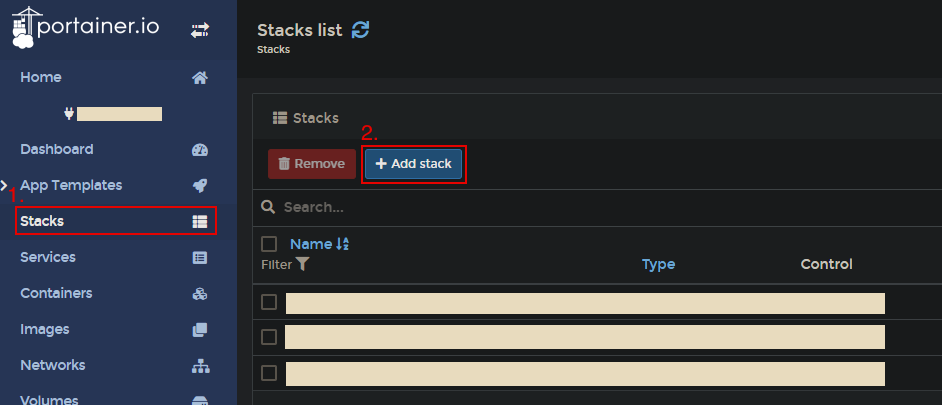
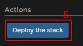

# portainer-capability-manager

I've been using [swarm-proxy-service](https://github.com/fopina/docker-swarm-service-proxy) for running containers with extra capabilities (or privileged) as docker swarm did not support those.

Finally came docker 20.10 and added capabilities to stacks/services ([docker/cli#2687](https://github.com/docker/cli/pull/2687)) but [portainer doesn't support it yet](https://github.com/portainer/portainer/issues/4684).  
This service will try to complement it, by performing a service upgrade on the services created by portainer (as suggested [in the same issue](https://github.com/portainer/portainer/issues/4684))

* Loop through events (same as `docker events --filter type=service --filter event=update` - ref: [event types](https://docs.docker.com/engine/reference/commandline/events/#object-types))
* Inspect each service add/updated and look for the labels: `io.portainerhack.cap_add` and `io.portainerhack.cap_drop`
  * *this is required because portainer literally ignores the `cap_add`/`cap_drop` entries so they can't be seen in the spec*
* If service has any of the labels, check its spec to see if the capabilities are there
* If not, update the service with the missing capabilitiles (same as `docker service update --cap-add XXX SERVICE_ID`)

## Table of Contents

- [Install](#install)
- [Usage](#usage)

## Install

As this only monitors `service` events it only needs to run in a **single node** of the swarm cluster but that node needs to be a **manager**.

The standard stack compose (in portainer) would be:

```yaml
version: '3.8'

services:
  monitor:
    image: fopina/portainer-capability-manager:0.1.1
    volumes:
      - /var/run/docker.sock:/var/run/docker.sock
    deploy:
      mode: replicated
      replicas: 1
      placement:
        constraints: [node.role == manager]
```

<br>

### Steps to add this to Portainer:

1. Click the "Stacks" menu item in your desired Docker Environment
2. Add a new stack



3. Give it any name
4. Paste in the "standard stack compose" listed above


5. Deploy the stack



**Congratulations**, your containers (& services/stacks) should automatically be assigned the capabilites.
Keep reading below to learn how to apply these labels.

## Usage

A service that needs a capability can now be defined such as:

Add the following label to your container/service
```yaml
io.portainerhack.cap_{add/drop}: {CAPABILITY_NAME}
```
<br>

Here's an **example** of a Docker stack compose YML with the label applied:


```yaml
version: '3.8'

services:
  vpnd:
    image: fopina/wireguard:0.1
    ...
    cap_add:
      # this is dropped by portianer but keep it for clarity (and future?)
      - NET_ADMIN
    deploy:
      labels:
        io.portainerhack.cap_add: NET_ADMIN
      mode: replicated
      replicas: 1
```

Both `io.portainerhack.cap_add` and `io.portainerhack.cap_drop` also support a comma-separated list of capabilities, if more than one is required:

```yaml
...
    deploy:
      labels:
        io.portainerhack.cap_add: NET_ADMIN,SYS_MODULE
...
```


